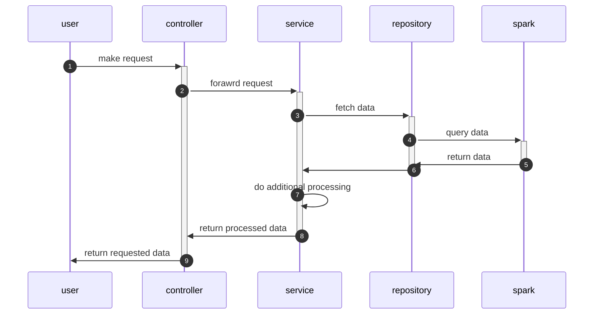

# Simple Data Platform

This project is to showcase a simple platform that can be used to query big data.

## Dependencies

The platform is built using the following technologies:

1. Java 21
2. Spring Boot 3.3
3. Maven
4. Docker
5. Spark

## How to run

1. Enable Docker on your machine
2. Run the following command to build the project:
    ```bash
    ./bin/setup
    ```
3. Run the following command to start the project:
    ```bash
    ./bin/run $port
    ```
   Default port is 8080 if not provided

## Data

Dataset is obtained from taxi trips in Chicago for the year 2020. It's in parquet format.
To setup data please set the path in the properties, eg

```yaml
dataset:
    file:
        path: src/main/resources/chicago_taxi_trips_2020.parquet
```

## APIs

1. Get Total Trips
    ```bash
    curl -X GET "http://localhost:8080/api/v1/data//total-trips?start={start_date}&end={end_date}"
    ```
2. Get Average Fare Heatmap
    ```bash
    curl -X GET "http://localhost:8080/api/v1/data/average-fare-heatmap?data={date}"
    ```
3. Get Average Speed in 24 Hours
   ```bash
   curl -X GET "http://localhost:8080/api/v1/data/average-speed-24hrs?date={date}"
   ```

## Architecture

This project is built based on common/standard Spring Boot architecture, where it's divided into 3
layers:

1. Controller layer where the API is defined. Controller layer here is using Spring Webflux.
2. Service layer where the business logic is defined. It's just a standard Java codes.
3. Repository layer where the data access is defined. Repository layer here is using Spark to access
   the parquet data.



## Misc

1. Swagger UI: http://localhost:8080/swagger-ui.html

---
&copy; 2024 Andreas Arifin
